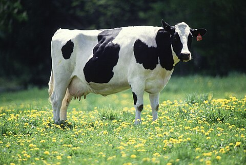

# Begrazingsproject De Westhoek

Het gebied kent dit begrazingsbeheer sinds 2009 waarbij duingraslanden, droge en vochtige duinheiden en duinstruwelen - die in mozaïek voorkomen - samen zijn ingerasterd. Aanvullend machinaal beheer gebeurt onder andere door afschrapen van vegetatie om verstuiving te herstellen. Het overkoepelende beheer van bos, struweel, grasland en open duin richt zich op het behoud van biodiversiteit, herstel van verstuiving en ondersteuning van doelsoorten. Het begrazingsproject heeft als voornaamste doel het behoud en herstel van duinnatuur door gecontroleerde begrazing.

In de Westhoek monitoren we het terreingebruik in twee begrazingsrasters: Westhoek Noord (81 ha) en Westhoek Zuid (54 ha) (zie figuur @). In het zuidelijke raster graasden in de periode 2021-2025 één kudde Shetland-pony’s van 5 dieren, één kudde Konik-paarden van 6 dieren en één kudde Schotse Hooglandrunderen van x dieren. In het noordelijk deel graasden twee kuddes Konik-paarden van 7 en 4 dieren en één kudde Schotse Hooglandrunderen van x dieren. Westhoek Noord en Westhoek Zuid waren tot oktober 2023 enkel verbonden in de winterperiode. Vanaf dan werden de graasgebieden permanent verbonden. De deelkuddes Konik-paarden bleven bestaan.

Dit resulteert in een gemiddelde graasdruk van xx in WHN, xx in WHZ grootvee-eenheden per ha per jaar. Het gaat om circa xx graasdagen per hectare per jaar.


## Terreingebruik in de Westhoek

## Figuur 1: Kaart

```{r grazers-map2, fig.cap="Kaart van terreingebruik door grote grazers in Vlaanderen"}
